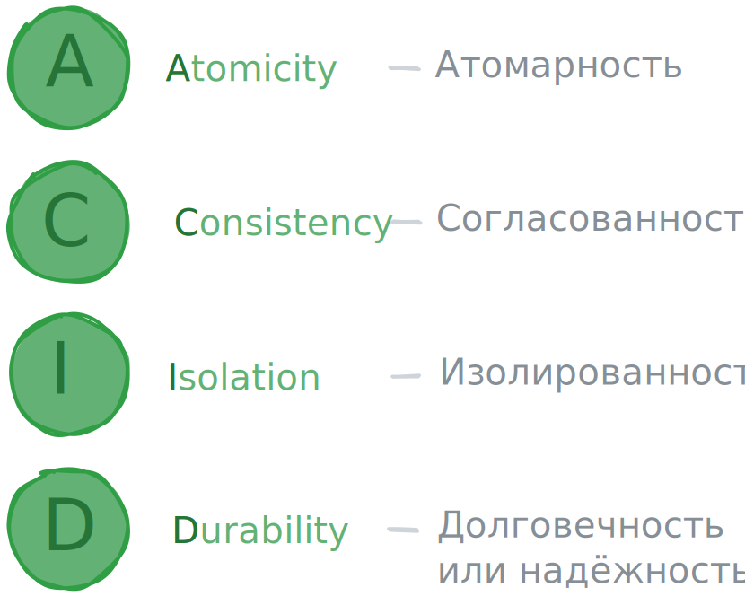

# ACID-требования к транзакциям

Чтобы обеспечить надёжность и целостность данных в БД, важно, чтобы транзакции выполнялись без сбоев.
Для этого стандарт SQL устанавливает к транзакциям ряд требований.
При разработке СУБД эти требования необходимо учитывать для создания механизма работы с данными.
Для пользователей СУБД эти требования - неотъемлемая часть свойства каждой транзакции.

Чтобы СУБД всегда успешно выполняли транзакции, они должны соответствовать требованиями ACID.

<p align="center"></p>

Разберем эти понятия подробнее.

**Атомарность (A - Atomicity)** - от слова «атом», в переводе с греческого «неделимый».
Атомарность указывает на неделимость и целостность транзакции.
Это значит, что все операции в транзакции либо успешно выполняются вместе, либо отменяются.

**Согласованность (C - Consistency)** - транзакция не разрушает взаимной согласованности данных.
Это значит, что каждая успешная транзакция только допустимые для этой БД результаты.

Продолжим пример из предыдущего урока. Таблица `account_transactions` содержит столбец `account_id`,
который является внешним ключом и ссылается на столбец `id` в таблице `accounts`.
Допустим запрос №3 выглядит так:

```sql
INSERT INTO account_transactions 
    (account_id, transaction_amount, transaction_type)
VALUES 
    (8, 500, 'W');
```

Здесь добавляется строка `account_id = 8` в таблицу `account_treansactions`.
При этом такого `id` нет в таблице `accounts` - поэтому такая операция невозможна.

Благодаря внешнему ключу СУБД понимает, что этот запрос `INSERT` невалиден, и он приведёт к несогласованности данных:
в таблице будет строка, у которой нет соответствующего значения в другой таблице.

По принципу согласованности такой запрос, как и вся транзакция, которая его содержит, отменится.
Так сохранится целостность данных.
Этот принцип гарантирует, что каждая успешная транзакция оставляет базу данных в состоянии,
которое удовлетворяет всем заложенным правилам и ограничениям.

Не все аспекты бизнес-логик можно представить в виде простых ограничений, которые задаются на уровне БД.
Как в примере выше когда средства сначала списываются с одного счёта, а затем зачисляются на другой.
За согласованность данных в таком случае отвечает разработчик.
Он решает, какие запроса объединить в единую транзакцию, а какие - нет.

**Изолированность (I-Isolation)** - обеспечивает независимость каждой транзакции от других.
Каждая транзакция выполняется так, как если бы она была единственной операцией, которая происходит в системе.
Это дает надёжность обработки данных и помогает избежать проблем,
которые могут возникнуть при одновременном доступе к общим данным. Например, такой:

Со счёта с `id = 1` на пустой счёт с `id = 4` в рамках первой транзакции переводят 1000 условных единиц.
Запрос увеличения баланса на счёте `4` уже выполнился и сейчас там 1000 у.е. В этот момент стартует вторая транзакция,
которая хочет списать со счёта `4` в пользу счёта с `id = 2` те же 1000 у.е.
Если вторая транзакция видит изменения первой, она видит деньги на счёте и переводит их.
Вторая транзакция успешно завершается - на счёте `4` теперь 0 у.е. 
В этот момент в первой транзакции происходит какая-то ошибка, и транзакция отменяется.
При этом средства уже были списаны во второй транзакции - возникает конфликт данных.

На практике полной изолированности добиться сложно, поэтому есть понятие «уровни изоляции»,
когда транзакция изолируется не полностью. Вы подробно рассмотрите уровни изоляции в будущий уроках.

**Долговечность или надежность (D - Durability)** - гарантирует, что если пришло подтверждение о выполнении транзакции,
то изменения, вызванные этой транзакцией не могут быть потеряны из-за каких-либо сбоев
(например, отключение электричества). Изменения гарантированнно внесены в БД, а данные согласованы.

ACID-требование к транзакциям гарантируют целостность данных,
возможность и безопасность одновременной работы, а также устойчивость к сбоям.