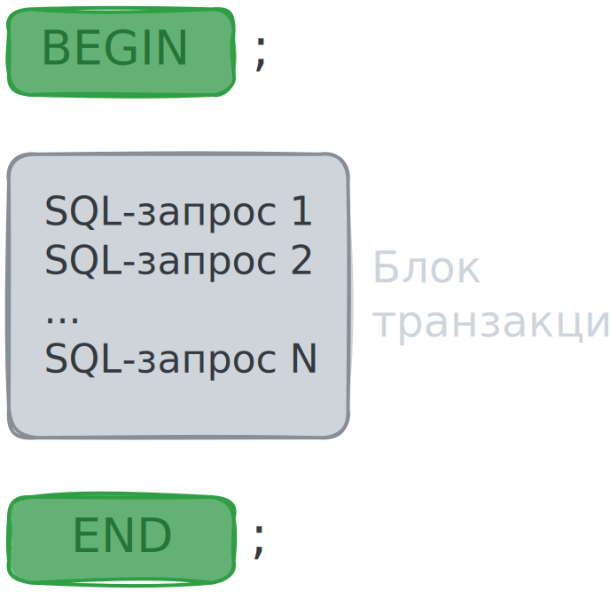
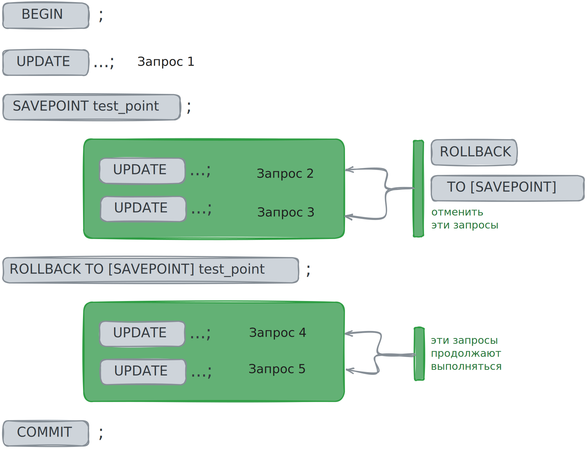

# Запросы с транзакциями

В прошлых уроках вы познакомились с транзакциями и их ключевыми особенностями,
а в этом уроке узнаете, как работать с транзакциями.

В PostgreSQL транзакция начинается с команды `BEGIN;` и заканчивается командой `COMMIT;`.
Весь код SQL между этими командами считается одной транзакцией. Также его называют *блоком транзакции*.

<p align="center"></p>

Изменения, сделанные в транзакции, но ещё не зафиксированные командой `COMMIT`,
называются *незафиксированные изменения*. Если вы захотите отменить эти изменения, выполните команду `ROLLBACK` - она
откатит состояние базы данных к тому, что было до начала транзакции.

Есть ряд ситуаций, при которых до момента выполнения команды `COMMI`,
все незафиксированные изменения становятся недоступными.
Например, если в одном из запросов транзакции возникает ошибка или произойдет сбой в работе БД.

Команду `COMMIT` используют для того, чтобы закрепить в БД изменения, внесённые текущей транзакцией.
Транзакцию, изменения которой были зафиксированы командой `COMMIT, называют *подтверждённой или зафиксированной*.

Вернёмся к задаче с переводом денег с одного счёта на другой.

Есть две таблицы: `accounts` с информацией о балансах на счетах и `account_transactions` со всеми операциями по счетам.
Описание таблиц и скрипты их создания вы разбирали в первом уроке темы.

Также в первом уроке вы рассмотрели четыре SQL-запроса, которые переводят средства с одного счёта на другой,
и выяснили, что необходимо создать одну неделимую транзакцию для выполнения этих запросов.

Вот как это будет выглядеть в формате единой транзакции:

```sql
BEGIN;  -- открываем транзакцию
    UPDATE accounts
    SET balance = balance - 500,
        last_update = CURRENT_TIMESTAMP
    WHERE account_number = 'BG22UBBS890';
    
    UPDATE accounts
    SET balance = balance + 500,
        last_update = CURRENT_TIMESTAMP
    WHERE account_number = 'BG31UBBS012';

    INSERT INTO account_transactions 
        (account_id, transaction_amount, transaction_type)
    VALUES 
        (1, 500, 'W');

    INSERT INTO account_transactions 
        (account_id, transaction_amount, transaction_type)
    VALUES
        (3, 500, 'D');
COMMIT;  -- завершаем транзакцию
```

Можно запустить весь код целиком или каждую команду последовательно.

После выполнения запроса балансы счетов изменились, а в списке операций появились две новые строки.

`accounts`:

| id | account_number | balance  | last_update         |
|----|----------------|----------|---------------------|
| 1  | BG22UBBS890    | 4500.00  | 2023-06-01 10:00:05 |
| 3  | BG31UBBS012    | 15500.00 | 2023-06-01 10:00:05 |
| 2  | BG79UBBS901    | 3000.00  | 2023-05-21 00:00:00 |


`account_transaction`: 

| id | account_id | transaction_amount	 | transaction_type | created_at          |
|----|------------|---------------------|------------------|---------------------|
| 1  | 1          | 1000.00             | 	D               | 2023-05-30 00:00:00 |
| 2  | 1          | 500.00              | 	W               | 2023-05-29 00:00:00 |
| 3  | 2          | 1500.00             | 	D               | 2023-05-31 00:00:00 |
| 4  | 3          | 5000.00             | 	W               | 2023-05-30 00:00:00 |
| 5  | 1          | 500.00              | 	W               | 2023-06-01 10:00:05 |
| 6  | 3          | 500.00              | 	D               | 2023-06-01 10:00:05 |

Теперь разберём, что случится, если один из запросов не сработает.
Ситуацию с падением сервера воспроизвести сложно,
но можно изменить один из запросов так, чтобы он стал некорректным.

Например, в запросе №3 исправьте значение для столбца `account_id` и укажите такой `account_id`,
которого нет в таблице со счетами:

```sql
INSERT INTO account_transactions 
    (account_id, transaction_amount, transaction_type)
VALUES 
    (8, 500, 'W');
```

Снова откройте транзакцию и запустите все запросы, но поочерёдно,
так как pgAdmin при работе из окна Query Tool не перейдёт к следующему запросу, если предыдущий завершился ошибкой.

Перед тем как выполнить запрос №3, сделайте `SELECT` из таблицы `accounts`,
чтобы посмотреть, какие изменения уже внесены. Вы увидите, что баланс счетов поменялся:

| id | account_number | balance  | last_update         |
|----|----------------|----------|---------------------|
| 1  | BG22UBBS890    | 4000.00  | 2023-06-01 10:10:34 |
| 3  | BG31UBBS012    | 16000.00 | 2023-06-01 10:10:34 |
| 2  | BG79UBBS901    | 3000.00  | 2023-05-21 00:00:00 |


Теперь выполните запрос №3. Результатом станет ошибка:

```
ERROR: Key (account_id)=(8) is not present in table "accounts".
       Insert or update on table "account_transactions" violates foreign key 
       constraint "account_transactions_account_id_fkey”
```

Ошибка говорит, что ключа `account_id = 8` нет в таблице `accouts`,
и вставка данных или обновление таблицы `account_transactions`
нарушает ограничение внешнего ключа `account_transactions_account_id_fkey`.

Транзакция прервалась ошибкой, и теперь нужно отменить все изменения в данных, которые были внесены это транзакцией,
так как для решения задачи должны выполниться все четыре запроса, либо ни один.

Чтобы полностью отменит транзакцию и вернуть к состоянию, которое было до старта транзакции - до `BEGIN`,
используйте оператор `ROLLBACK`. Откатите транзакцию:

```sql
ROLLBACK;
```

и проверьте, что баланс на счетах в таблице `accounts` вернулся к значениям, которые были до старта транзакции:

| id | account_number | balance  | last_update         |
|----|----------------|----------|---------------------|
| 1  | BG22UBBS890    | 4500.00  | 2023-06-01 10:00:05 |
| 3  | BG31UBBS012    | 15500.00 | 2023-06-01 10:00:05 |
| 2  | BG79UBBS901    | 3000.00  | 2023-05-21 00:00:00 |

`ROLLBACK` можно использовать в любой момент,
когда вы передумали фиксировать транзакцию и хотите отменить вс внесённые изменения.

При этом если в текущей транзакции произошла ошибка и выполнение транзакции уже прервано,
то при попытке выполнить какой-либо другой запрос PostgreSQL выдаст такое сообщение:

```
ERROR:  current transaction is aborted, commands ignored until 
        end of transaction block
ОШИБКА: текущая транзакция прервана, команды до конца блока транзакции 
        игнорируются

SQL state: 25P02 
```

Это сообщение об ошибке означает, что несмотря на то, что выполнение транзакции уже было прервано,
PostgreSQL всё рано ждёт `ROLLBACK`.
То есть СУБД, не может самостоятельно закрыть явно отрытую транзакцию в случае ошибки,
поэтому выполнить `ROLLBACK` - обязательно.

## Точки сохранения транзакций

Также транзакции можно откатить не полностью, а к некоторой сохранённой точке внутри транзакции.
Для создания такой точки используют конструкцию `SAVEPOINT имя_точки_сохранения`.

### Команда `ROLLBACK`
Чтобы откатить транзакцию к точке сохранения, то есть отменить запросы,
которые были выполнены после неё, применяют команду `ROLLBACK TO [SAVEPOINT] имя_точки_сохранения`.
При этом, если после `ROLLBACK TO` в транзакции есть ещё запросы, они продолжат выполняться.

<p align="center"></p>

Если во время выполнения скрипты произойдет ошибка,
все дальнейшие можно выполнить только вручную - автоматически они не выполнятся.

Команда `ROLLBACK` без указания точки сохранения отменить всю транзакцию целиком.

 ### Команда `RELEASE`
Чтобы удалить точку сохранения, применяют команду `RELEASE [SAVEPOINT] имя_точки_сохранения`.

В PostgreSQL ключевое слово `SAVEPOINT` в командах `ROLLBACK` и `RELEASE` можно не использовать.
Поэтому, чтобы обозначить его необязательность, заключают в квадратные скобки - как и в документации.

В транзакции можно создать несколько точек. Назвать точки можно одним именем или разными.
Если назвать одним именем несколько `SAVEPOINT`, использоваться будет только та точка,
которая была объявлена последней - при откате транзакции и удалении точки сохранения.
Если эту точку удалить, далее в транзакции будет использоваться точка с таким же именем,
которая была объявлена до удаления. И так далее, если таких точек несколько.

Если в рамках одной транзакции установлено несколько точек сохранения и применяется команда `ROLLBACK TO`
для отката к одной из этих точек, то все запросы, выполненные после этой точки сохранения, отменятся.
Более того, все точки сохранения, установленные после той, к которой откатывается транзакция, также удалятся.
Логично - ведь все запросы после `SAVEPOINT`, в том числе и на создание других `SAVEPOINT`, удаляются.

Удалять точки сохранения необязательно, но это позволяет системе освобождать некоторые ресурсы раньше, чем завершится транзакция.

___

SQL-запросы для выполнения проверочного задания:
```sql
BEGIN;
    UPDATE ...;   -- запрос 1
    SAVEPOINT test_point;
    UPDATE ...;   -- запрос 2
    SAVEPOINT test_point;  
    UPDATE ...;   -- запрос 3
  ROLLBACK TO SAVEPOINT test_point;
    UPDATE ...;   -- запрос 4
  RELEASE SAVEPOINT test_point;
  ROLLBACK TO SAVEPOINT test_point;
    UPDATE ...;   -- запрос 5
COMMIT;
```