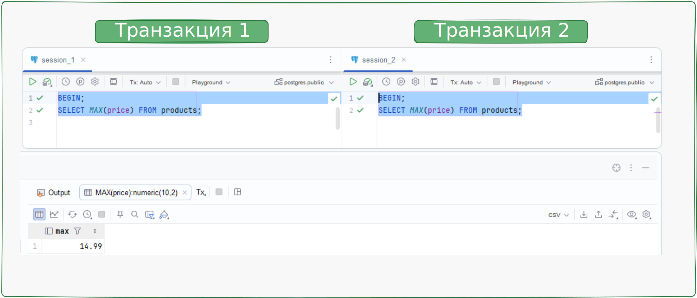
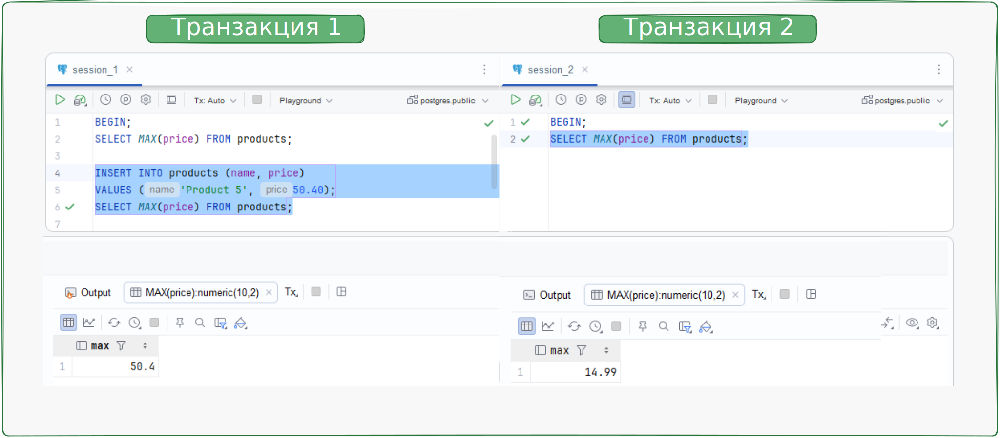
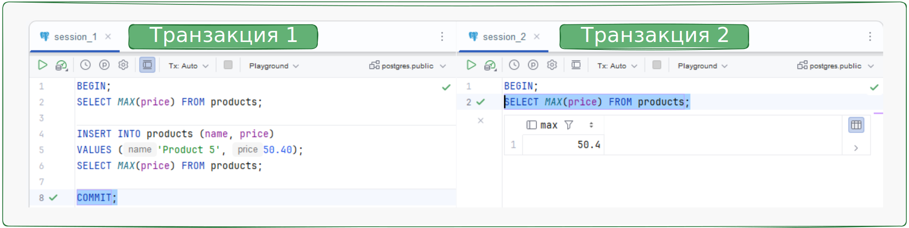
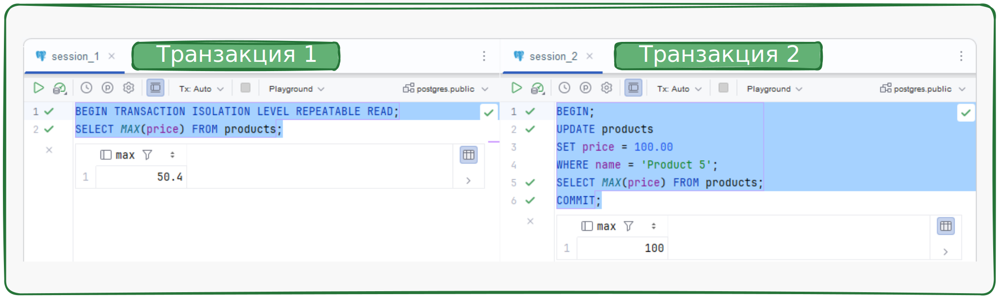
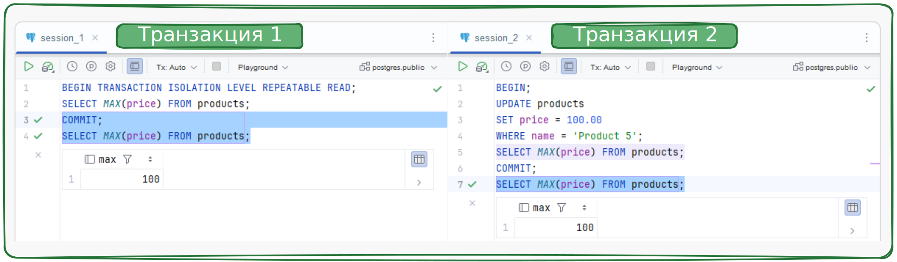
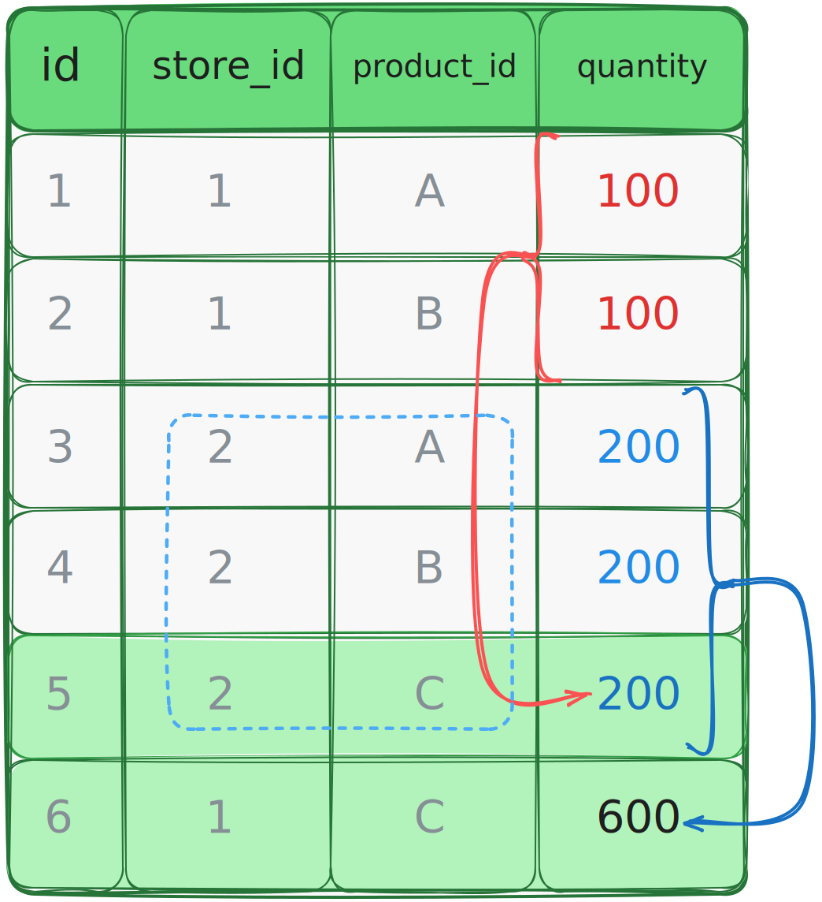

# Изоляции транзакций. Синтаксис

В прошлом уроке вы узнали, какие есть уровни изоляции, и рассмотрели особенности их реализации в PostgreSQL.
В этом уроке вы продолжите изучать транзакции:
познакомитесь с синтаксисом запросов с транзакциями разных уровней изоляции 
PostgreSQL и разберёте работу уровней изоляции на примерах.

Установить нужный уровень изоляции для транзакции можно несколькими способами.

* Указать при старте:
```sql
BEGIN TRANSACTION ISOLATION LEVEL <*нужный_уровень_изоляции*>;
```

* Задать командой `SET TRASACTION ISOLATION LEVEL` внутри транзакции.
Команда выполняется после старта, но до выполнения любых операций в рамках этой транзакции:
```sql
BEGIN;
    SET TRANSACTION ISOLATION LEVEL <*нужный_уровень_изоляции*>;
```

* Задать командой `SET SESSION CHARACTERISTICS AS TRANSACTION ISOLATION LEVEL` для вашей сессии.
Команда устанавливает уровень изоляции для всех будущих транзакций в текущей сессии.
> **Сессия** - подключение между клиентом и сервером БД.
> Когда клиент (например, приложение или интерфейс командной строки) подключается к серверу БД, он начинает сессию.
> Все запросы, которые клиент отправляет серверу в рамках этого подключения, считаются частью этой сессии.
```sql
SET SESSION CHARACTERISTICS AS TRANSACTION ISOLATION LEVEL 
<*нужный_уровень_изоляции*>;
```

Если при открытии транзакции нигде явно не указать, какой уровень изоляции использовать, PostgreSQL считает,
что достаточно уровня `READ COMMITTED` и по умолчанию использует его.

Подключитесь к локальной БД, используя любой удобный вам клиент, и выполняйте запросы из примеров по ходу урока.
Примеры в уроке выполнены в среде разработки IntelliJ IDEA Ultimate, но вы по желанию можете использовать другой клиент:

## Пример 1 - как работает уровень изоляции `READ COMMITTED`

Создайте тестовую таблицу `products`:

```sql
DROP TABLE IF EXISTS products CASCADE;

CREATE TABLE products (
    name VARCHAR(50),
    price NUMERIC(10, 2)
);

INSERT INTO products (name, price)
VALUES
    ('Product 1', 12.50),
    ('Product 2', 10.40),
    ('Product 3', 7.99),
    ('Product 4', 14.99);
```

Откройте транзакцию уровня изоляции `READ COMMITTED`. Указывать уровень явно нет необходимости,
так как `READ COMMITTED` используется по умолчанию.
В транзакции проверьте максимальное значение цены среди всех продуктов.

```sql
BEGIN;
SHOW transaction_isolation;
SELECT MAX(price) FROM products;
```

> Команда `SHOW transaction_isolation` вернёт значение: `read committed`.

Теперь создайте новую Query Console, запустите
в этом окне новую транзакцию и выведите максимальное значение цены из таблицы `products`.
Убедитесь, что результаты запросов с `MAX` совпадают:

<p align="center"></p>

Далее в окне Query Console для сессии с транзакцией 1 выполните `INSERT` и снова проверьте максимальное значение:

```sql
INSERT INTO products (name, price)
VALUES ('Product 5', 50.40);
SELECT MAX(price) FROM products;
```

Во втором окне выполните только `SELECT` и убедитесь, что максимальное значение не изменилось:

<p align="center"></p>

Здесь стоит обратить свое внимание на то, что у нас по-умолчанию указан уровень изоляции `READ COMMITTED`
и мы не можем увидеть неподтвержденные изменения другой транзакции. Чтобы данные внесённые командой `INSERT`
в первой транзакции, стали доступны во второй транзакции, нужно завершить первую транзакцию командой `COMMIT`.
До тех пор, пока не будет выполнен `COMMIT` в транзакции, которая вносит изменения в данные,
друие транзакции не смогут увидтеь эти измененияю.

Выполните команду `COMMIT` и проверьте результат:

<p align="center"></p>

Максимальное значение цены в Query Console для сессии с транзакцией 2 также изменилось.
Когда вы только начали вторую транзакцию, максимальное значение цены было одно.
Через некоторое время в этой же транзакции вы получили другое максимальное значение цены,
потому что в таблицу добавились новые строки в другой транзакции. Это пример аномалии «фантомное чтение», которая может
появляться в транзакциях уровня `READ COMMITTED`.

Выполните команду `COMMIT`, чтобы закрыть транзакцию 2.

___

## Пример 2 - как работает уровень изоляции `REPEATABLE READ`

Давайте проверим, действительно ли уровень изоляции `REPEATABLE READ` в PostgreSQL
поможет избежать аномалии фантомного чтения, которую вы получили в предыдущем примере.

Выполните те же действия, что и в первом примере, только уровень изоляции для транзакции 1 укажите `REPEATABLE READ`.

> Обратите внимание, что Вам необходимо закрыть все открытые транзакции прошлого примера, если такие остались.

В первой Query Console откройте новую транзакцию и выполните запрос для получения максимального значения цены:

```sql
BEGIN TRANSACTION ISOLATION LEVEL REPEATABLE READ;
    SELECT MAX(price) FROM products;
```

Во втором окне откройте новую транзакцию, её уровень изоляции неважен.

Измените значение цены для `'Product 5'` и зафиксируйте изменения командой `COMMIT;`:

```sql
BEGIN;
    UPDATE products
    SET price = 100.00
    WHERE name = 'Product 5';
COMMIT;
```

> Так как здесь всего один `UPDATE`-запрос в рамках транзакции, необязательно объявлять его отдельной транзакцией.
> 
> В PostgreSQL если запрос не вложен в явно объявленную транзакцию с использованием команд `BEGIN`, `COMMIT`
> или `ROLLBACK`, он считается автономной транзакцией. Это значит, что каждый запрос выполняется
> в своей транзакции и автоматически подтверждается при успешном завершении (`COMMIT`) или
> откатывается в случае ошибки(`ROLLBACK`).
> 
> Это называется **автокоммит (autocommit)** - он гарантирует атомарность каждого отдельного запроса.

Вернитесь к первой транзакции и сова выполните `SELECT MAX()`. Максимальное значение не изменилось:

<p align="center"></p>

Это произошло потому, что изменения, зафиксированные в других транзакциях,
не должны быть видны в рамках текущей транзакции до её заверения.

Если сейчас для первой транзакции выполнить `COMMIT;` и проверить значение `SELECT MAX()`,
оно уже будет другим - соответствующим изменённой цене:

<p align="center"></p>

Итак, вы убедились - уровень изоляции `REPEATABLE READ` в PostgreSQL гарантирует
стабильность данных во время транзакции, предотвращая их изменение из других транзакций.

Такой уровень изоляции может быть полезен в ситуациях, когда нужно сделать много сложных вычислений.
Например, для аналитической отчетности - если вычисления могут занять длительное время и важно,
чтобы в течении этого времени уже полученные промежуточные результаты не менялись,
даже если эти данные были изменены другими транзакциями. Потому что фантомные чтения могут привести к несогласованным
результатам внутри итогового отчёта.

## Пример 3 - аномалия сериализации, какая ты?

Для работы с товарами на разных складах ведут журнал учёт, в котором отмечают:

* полную историю поступлений товара на склад;
* дату получения товара;
* актуально ли количество товара (булево значение).

Создайте таблицу для хранения данных журнала:

```sql
CREATE TABLE warehouse_movements
(
    id SERIAL PRIMARY KEY,
    store_id INTEGER,
    product_id CHARACTER(5),
    quantity INTEGER,
    update_date TIMESTAMP WITHOUT TIME ZONE DEFAULT CURRENT_TIMESTAMP,
    is_actual BOOL DEFAULT TRUE
);
```

Добавьте строки для тестирования:

```sql
INSERT INTO warehouse_movements (
    store_id,
    product_id,
    quantity)
VALUES
    (1, 'A', 100),
    (1, 'B', 100),
    (2, 'A', 200),
    (2, 'B', 200);
```

`'A'` и `'B'` - это товары на складах `1` и `2`.

Оказалось, что товары `'A'` и `'B'` ошибочно промаркировали как разные. Поэтому решили эти товары со склада `1`
переместить на склад `2`, просуммировать их количество и обозначить такой товар как `'C'`,
а на складе отметить товары неактуальными.

В это же время менеджер склада `2` решил отправить все свои товары `'A'` и `'B'` и `'C'` на склад `1`,
также просуммировав и обозначив как товары с новым кодом - вот такой непостоянный менеджмент склада.

Итого: сумма всех товаров со склада `1` добавляется как новая строка, но на склад `2`,
а сумма всех товаров со склада `2` - как новая строка на склад `1`: 

<p align="center"></p>

Откройт две Query Console и в каждой начните транзакции уровня изоляции `REPEATABLE READ`:

```sql
BEGIN TRANSACTION ISOLATION LEVEL REPEATABLE READ;
```

В первой Query Console для сессии с транзакцией 1 выполните код:

```sql
-- Переместите товары со склада 1 на склад 2 и промаркируйте как товар 'C':
INSERT INTO warehouse_movements (
    store_id,
    product_id,
    quantity)
SELECT 2, 'C', qnt
FROM (
    SELECT SUM(quantity) AS qnt
    FROM warehouse_movements
    WHERE store_id = 1) AS t;
```

Во второй Query Console для сессии с транзакцией 2 выполните код:

```sql
-- Переместите все товары со склада 2 на склад 1 и промаркируйте как товар 'C':
INSERT INTO warehouse_movements (
    store_id,
    product_id,
    quantity)
SELECT 1, 'C', qnt
FROM (
         SELECT sum(quantity) AS qnt
         FROM warehouse_movements
         WHERE store_id = 2) AS t;
```

Выполните запросы, чтобы показать неактуальность товаров, и завершите транзакции.

Сначала первую:

```sql
-- Укажите, что записи для склада 1 стали неактуальны:
UPDATE warehouse_movements
SET is_actual = FALSE
WHERE store_id = 1;

COMMIT;
```

Потом вторую:

```sql
-- Укажите, что записи для склада 2 стали неактуальны:
UPDATE warehouse_movements
SET is_actual = FALSE
WHERE store_id = 2;

COMMIT;
```

Проверьте результат работы в таблице `warehouse_movements`:

| id | store_id | product_id | quantity | update_date                 | is_actual |
|----|----------|------------|----------|-----------------------------|-----------|
| 1  | 1        | A          | 100      | 2023-07-28 11:47:15.827407  | FALSE     |
| 2  | 1        | B          | 100      | 2023-07-28 11:47:15.827407  | FALSE     |
| 3  | 2        | A          | 200      | 2023-07-28 11:47:15.827407  | FALSE     |
| 4  | 2        | B          | 200      | 2023-07-28 11:47:15.827407  | FALSE     |
| 5  | 2        | C          | 200      | 2023-07-28 11:48:22.545667  | TRUE      |
| 6  | 1        | C          | 400      | 2023-07-28 11:48:22.545667  | TRUE      |

Если бы транзакции выполнялись последовательно: сначала первая, затем вторая, результат был бы такой:

| id | store_id | product_id | quantity | update_date                 | is_actual |
|----|----------|------------|----------|-----------------------------|-----------|
| 1  | 1        | A          | 100      | 2023-07-28 11:47:15.827407  | FALSE     |
| 2  | 1        | B          | 100      | 2023-07-28 11:47:15.827407  | FALSE     |
| 3  | 2        | A          | 200      | 2023-07-28 11:47:15.827407  | FALSE     |
| 4  | 2        | B          | 200      | 2023-07-28 11:47:15.827407  | FALSE     |
| 5  | 2        | C          | 200      | 2023-07-28 11:48:22.545667  | FALSE     |
| 6  | 1        | C          | 600      | 2023-07-28 11:48:22.545667  | TRUE      |

Если сначала вторая, а потом первая - такой:

| id | store_id | product_id | quantity | update_date                 | is_actual |
|----|----------|------------|----------|-----------------------------|-----------|
| 1  | 1        | A          | 100      | 2023-07-28 11:47:15.827407  | FALSE     |
| 2  | 1        | B          | 100      | 2023-07-28 11:47:15.827407  | FALSE     |
| 3  | 2        | A          | 200      | 2023-07-28 11:47:15.827407  | FALSE     |
| 4  | 2        | B          | 200      | 2023-07-28 11:47:15.827407  | FALSE     |
| 5  | 1        | C          | 400      | 2023-07-28 11:48:22.545667  | FALSE     |
| 6  | 2        | C          | 600      | 2023-07-28 11:48:22.545667  | TRUE      |

Результат параллельного выполнения транзакций отличается от
ожидаемого результата при их последовательном выполнении - это и есть аномалия сериализации.
Однако при уровне изоляции `REPEATABLE READ` эта аномалия не приводит к ошибке и не вызывает откат транзакции.

Если вы выполните пример 3, но с уровнем изоляции `SERIALIZABLE` одна из транзакций завершится ошибкой:

```
ERROR:  could not serialize access due to concurrent update
SQL state: 40001

ОШИБКА: не удалось сериализовать доступ из-за параллельного обновления
```