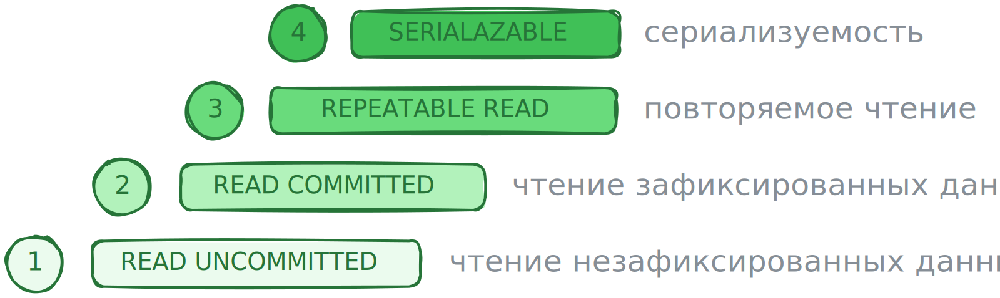
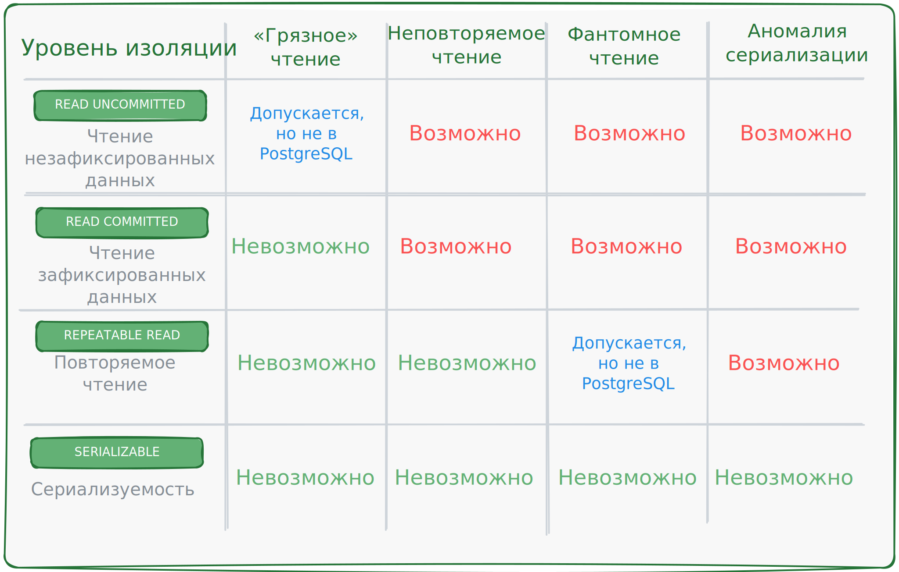

# Изоляция транзакций. Уровни

В предыдущих уроках вы познакомились с ACID-требованиями к транзакциям.
В этом уроке подробно поговори о требовании изолированности, или изоляции, транзакций.
Вы узнаете, какие уровни изоляции транзакций существуют и как их применять в работе.

В реальной жизни у базы данных множество клиентов, каждый из которых запускает свои транзакции,
и часто они делают это одновременно. Если каждая транзакция будет ждать завершения предыдущей,
такая СУБД будет работать крайне медленно, а такого быть не должно.

Чтобы обеспечить одновременную конкурентную работу транзакций, в БД есть **уровни изоляции**.
В стандарте SQL из четыре:

<p align="center"></p>

Эти уровни определяют, в какой степени одна транзакция может видеть изменения,
которые происходят в другой транзакции. Уровни упорядочены от самого свободного - наименее ограниченного по возможностям
видеть изменения, наименее изолированного до самого строгого.

На каждом уровне есть свой пул аномалий,
которые допускаются или не допускаются при одновременном выполнении транзакций на этом уровне.
Аномалии в контексте транзакций - это ситуации, которые могут возникнуть
при параллельном выполнении транзакции и привести к несогласованным,
неправильным результатам выполнения этих транзакций.

Иными словами, уровни изоляции транзакций - это фактически типы аномалий,
которые могут или не могут появиться на каждом из этих уровней.

Рассмотрим каждый уровень изоляции подробнее.

## Уровень 1. `READ UNCOMMITTED` - читаем незафиксированные данные

Этот уровень изоляции транзакций: 

* Позволяет транзакциям видеть изменения, внесённые другими неподтвержденными транзакциями;
* Не обеспечивает никакой защиты от взаимного влияния транзакций;
* Может привести к аномалии «грязное чтение», когда транзакция получает доступ к данным, 
которые ещё не были подтверждены.

Например, транзакция №1 уменьшает остаток товара на складе.
В этот момент транзакция №2 читает остаток товара на складе и получает изменённое в транзакции №1 значение. 
Тут же транзакция №1 прерывается из-за некоторого сбоя. Остаток на склдае возвращается к начальному значению,
а в транзакции №2 остаётся некорректное значение. Если это значение используют в дальнейших вычислениях,
все результаты вычислений будут некорректными.

## Уровень 2. `READ COMMITTED` - читаем зафиксированные данные

Этот уровень изоляции транзакций:

* Позволяет транзакциям видеть только подтвержденные изменения других транзакций;
* Исключает аномалию «грязное чтение»;
* Может привести к аномалиям «неповторяемое чтение» и «фантомное чтение».

**Неповторяемое чтение** - происходит, когда одна транзакция считывает некоторую строку данных,
а затем другая транзакция меняет или удаляет именно эту строку и фиксирует свои изменения.
Если первая транзакция снова считает эту строку, она обнаружит, что данные изменились или удалились.

Например, вы работаете в банке и смотрите баланс счёта клиента, который сейчас равен 1000 условных единиц.
Пока вы смотрите баланс, другой сотрудник банка проводит операцию и списывает 200 у.е. с того же счёта.
Когда вы снова смотрите баланс счёта, вы видите, что он снизился до 800 у.е.
Ваше чтение стало неповторяемым, так как результаты двух чтений,
выполненных вами в рамках одной транзакции, отличаются.

**Фантомное чтение** - происходит, когда одна транзакция считывает набор строк, соответствующих определённому условию,
а затем другая транзакция добавляет или удаляет какие-то из строк,
соответствующих этому условию, и фиксирует свои изменения.

Например, есть таблица с информацией по заказам. Менеджер магазина смотрит количество сделанных заказов за текущий день
и видит, что их 10. В это время поступает новый заказ и добавляется новая строка в таблицу заказов. 
Если менеджер повторит свой запрос к базе данных, он получит другое значение.

> * **Неповторяемые чтения** проявляются при чтении одной и той же строки данных;
> * **Фантомные чтения** проявляются при чтении набора строк, соответствующих определенному условию.

## Уровень 3. `REPEATABLE READ` - читаем данные повторно

Этот уровень изоляции транзакций:

* Гарантирует, что изменения, зафиксированные в других транзакциях во время выполнения текущей транзакции,
не будут видны в текущей транзакции до её завершения;
* Предотвращает повторное чтение, но может приводить к аномалиям сериализации
и в некоторых СУБД не предотвращает фантомное чтение.

**Аномалия сериализации** - ситуация, когда результаты параллельного выполнения нескольких транзакций
отличаются от результатов их последовательного выполнения.

Например, есть транзакция, которая выполняет некие вычисления. Параллельно её запускают вторую транзакцию,
которая должна использовать результаты этих вычислений.
В режиме изоляции `REPEATABLE READ` вторая транзакция не видит результаты вычисления первой транзакции,
пока та не завершит работу. В итоге вторая транзакция выполняет свои вычисления, но их результат отличается от того,
который был получен, если бы она выполнялась после завершения первой транзакции. 

Это не вызывает явных ошибок выполнения, однако в результате в базе появляются несогласованные данные,
а это может привести к проблемам. Несогласованные данные сложно обнаружить и исправить.
Если ваши транзакции зависят друг от друга и потенциально могут вызывать аномалии сериализации,
лучше уровень изоляции `REPEATABLE READ` не использовать.

Подробнее аномалию сериализации разберём в следующем уроке.

Также на этом уровне возможна принудительная отмена (откат) транзакции самой СУБД.
Это происходит при попытке двух параллельных транзакций изменить одни и те же данные.

Например, два пользователя хотят приобрести последний доступный билет на концерт.
Петя начинает транзакцию уровня `REPEATABLE READ` и видит, что билеты ещё доступны.
Люся также начинает транзакцию уровня `REPEATABLE READ` и видит, то билеты ещё доступны.
Петя покупает билет, и транзакция завершается успешно. Билетов больше нет в наличии,
но Люся начала свою транзакцию уровня `REPEATABLE READ` тогда, когда билеты ещё были в наличии,
а других изменений этот уровень не видит. Возникает противоречие в данных, и транзакция Люси завершается ошибкой:

```
ERROR:  could not serialize access due to concurrent update
SQL state: 40001

ОШИБКА: не удалось сериализовать доступ из-за параллельного изменения
```

Прерванные транзакции этого уровня должны обрабатываться на уровне приложения - это должен предусмотреть разработчик.
Обычно ПО пытается повторно начать транзакцию после короткого промежутка времени, рассчитывая,
что в этот раз она успешно завершится. В примере выше транзакция Люси могла бы быть автоматически перезапущена,
но на этот раз она бы не нашла билеты, потому что их уже купила транзакция Пети.

## Уровень 4. `SERIALIZABLE` - сериализуемые данные

Этот уровень изоляции транзакций:

* Самый строгий;
* Гарантирует, что транзакции будут выполняться так, как если бы они происходили последовательно,
исключая конфликты и аномалии.
* Обеспечивает полную изоляцию транзакций и создает иллюзию, что каждая транзакция - единственная в системе;
* Защищает ото все возможных аномалий, включая аномалию сериализации.

Если СУБД обнаруживает возможную аномалию сериализации, оан откатывает одну или несколько транзакций и выдает ошибку:

```sql
ERROR:  could not serialize access due to read/write dependencies among transactions
SQL state: 40001
Detail: Reason code: Canceled on identification as a pivot, during commit attempt.
Hint: The transaction might succeed if retried.

ОШИБКА: не удалось сериализовать доступ из-за зависимостей чтения/записи между
        транзакциями
```

На уровне изоляции `SERIALIZABLE` СУБД пристально отслеживает, какие строки или наборы строк в базе данных изменяются
в рамках каждой отдельной транзакции. Например, если две транзакции пытаются изменить одну и ту же строку одновременно, 
СУБД замечает этот конфликт и принимает меры для его разрешения.

В таких случаях нельзя заранее предсказать, какая транзакция выполнится первой и какие изменения
в итоге будут записаны в базу данных. СУБД ставит вторую транзакцию в очередь, а после того,
как первая транзакция завершится, можно отменить вторую транзакцию, чтобы предотвратить потенциальные проблемы
с целостностью данных.

Вот типичное сообщение об ошибке, которое может возникнуть в таких ситуациях:

```sql
ERROR:  could not serialize access due to concurrent update
SQL state: 40001
Hint: The transaction might succeed if retried.

ОШИБКА: не удалось сериализовать доступ из-за параллельного обновления
```

Сообщение об ошибке говорит,
что произошел конфликт при попытке одновременного изменения одних и тех же данных разными транзакциями,
и одна из транзакций отменилась. При этом СУБД советует запускать транзакцию снова, так как есть шанс, что повторное 
выполнение завершится успехом.

Обработка такого сбоя сериализации ложится на приложение - так же, как и на предыдущем уровне изоляции.
Разработчику нужно спроектировать приложение так,
чтобы оно могло корректно обработать эту ошибку и повторить транзакцию.
В некоторых случаях в приложении можно реализовать логику задержки перед повторной попыткой выполнения транзакции,
чтобы снизить вероятность повторения сбоя.

В разных СУБД эти четыре уровня изоляции транзакций могут быть реализованы по-разному - в зависимости
от внутренней архитектуры СУБД и методов обеспечения конкурентного доступа к данным.

## Уровни изоляции транзакций в PostgreSQL

В PostgreSQL для поддержки целостности данных и обеспечения параллельной
обработки транзакций реализована **модель многоверсионного управления конкурентным доступом
(англ. Multiversion Concurrency Control, MVCC)**.

Это означает, что каждый SQL-запрос в PostgreSQL работает со своей версий данных - так
называемым **снимком базы данных**. Снимок фиксирует данные на определённый момент времени,
и его не затрагивают параллельно проходящие изменения данных. Таким образом PostgreSQL
обеспечивает независимость каждой транзакции в рамках сеанса работы с базой данных.

Основное преимущество этой модели работы в том, что чтение никогда не мешает записи, а запись - чтению,
а это существенно ускоряет производительность СУБД при работе в многопользовательской среде.

Однако у MVCC есть и недостатки.
Например, она занимает много пространства на диске из-за хранения множетвенных версий каждой строки данных.

Чтобы освободить пространство, PostgreSQL использует процесс автоочистки (autovacuum).
Он автоматически удаляет старые версии данных, которые больше не доступны для активных транзакций.
Также можно принудительно запустить очистку командой `VACUUM`.
Это может быть полезно в определённых сценариях для управления ресурсами и производительностью базы данных.

Благодаря MVCC PostgreSQL обрабатывает уровни изоляции несколько иначе, чем стандарт SQL:

* `READ UNCOMMITTED` - для этого уровня любая транзакция получает снимок данных,
с которыми она работает, и не видит неподтверждённые изменения, которые внесли другие транзакции. 
Поэтому в PostgreSQL нет аномалии «грязное чтение».
Фактически этот уровень будет вести себя как следующий - `READ COMMITTED`;
* `REPEATABLE READ` - предотвращает возникновение «фантомных» чтений,
что по поведению делает его похожим на уровень `SERIALIZABLE`.

Суммируем уровни изоляции и аномалии в таблице:

<p align="center"></p>

> Если в вашем приложении необходимо использовать уровень изоляции `SERIALIZABLE`, его придётся использовать для всех
> транзакций приложения, чтобы обеспечить их единообразие и предсказуемое поведение. Иначе, если вместе с `SERIALIZABLE`
> использовать другие уровни изоляции, PostgreSQL без предупреждения будут обрабатывать транзакции `SERIALIZABLE` как
> транзакции уровня `REPEATABLE READ`.

## Какой уровень изоляции выбрать

Выбор уровня изоляции зависит от требований к решаемой задачи и характера или разновидности этой задачи.
Чтобы Вам проще было сориентироваться, преимущества и недостатки всех основных уровней собрали в таблице.
`READ UNCOMMITTED` в PostgreSQL работает также, как и `READ COMMITTED`, поэтому устанавливать его специально смысла нет.

| Уровень           | Преимущества                                                                                                                                                                                             | Недостатки                                                                                                                                                                                                                                                                                                                                                 |
|-------------------|----------------------------------------------------------------------------------------------------------------------------------------------------------------------------------------------------------|------------------------------------------------------------------------------------------------------------------------------------------------------------------------------------------------------------------------------------------------------------------------------------------------------------------------------------------------------------|
| `READ COMMITTED`  | Транзакция прервётся только при сбое работы БД, явной ошибке в SQL-конструкции или нарушении ограничений CONSTRAINT.                                                                                     | Риск возникновения различных аномалий. Разработчику нудно постянно помнить о них и писать код так, чтобы их избежать.                                                                                                                                                                                                                                      |
| `REPEATABLE READ` | Предотвращает большую часть аномалий, но не аномалию сериализации. Удобен при создании отчётности, когда нужно, чтобы на вычисления внутри транзакции не влияли обновления данных в других транзакциях.  | Не исключает аномалию сериалищзации, поэтому возможна несогласованность данных - это нужно учитывать при разработке. Необходимо написать код так, чтобы он корректно обрабатывал откаты транзакций в случае одновременной попытки изменения данных.                                                                                                        |
| `SERIALIZABLE`    | Предотвразает несогласованность в данных.                                                                                                                                                                | Последовательность выполнения параллельных транзакций определяет СУБД. Необходимо написать код так, чтобы он корректно обрабатывал откаты транзакций в случае если СУБД предполагает возникнование несогласованности в данных. Часто расходы на обработу откатов транзакции оказываются высокими и могт существено снизить производительность приложенгия. |